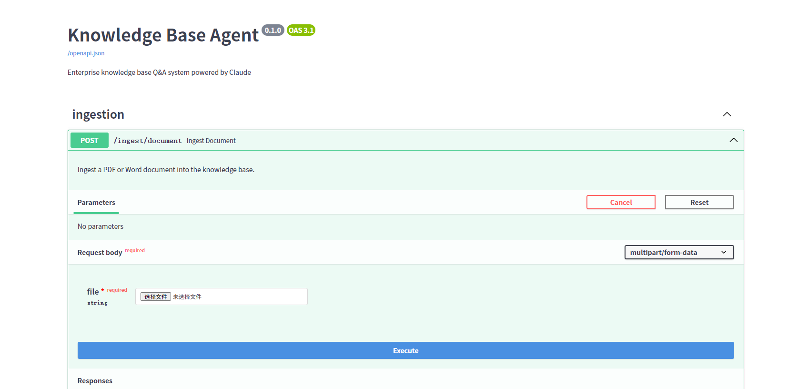
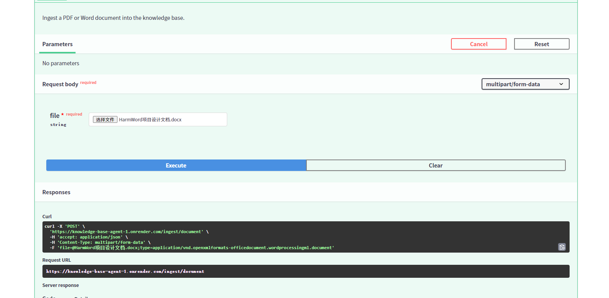
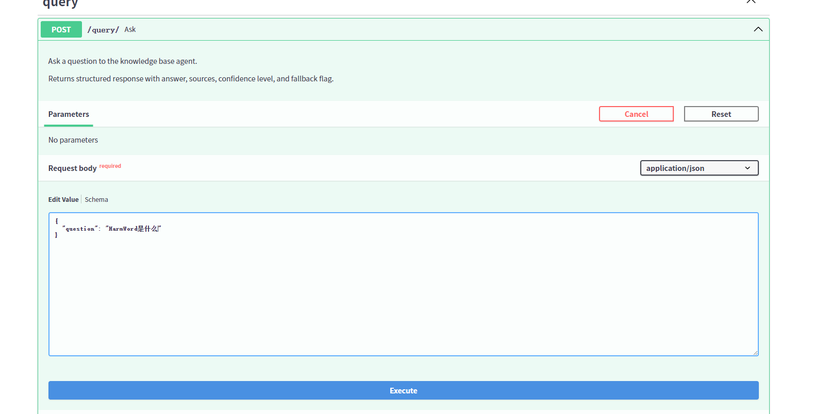
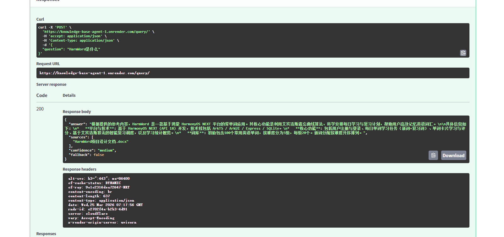
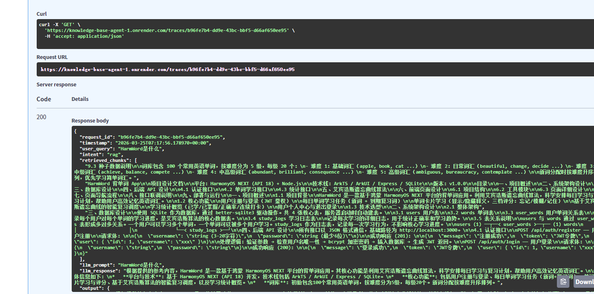

# Knowledge Base Agent

知识库问答 Agent — 基于 RAG + LLM Function Calling 实现意图路由与智能问答。

支持导入 PDF / Word 文档和网页 URL，自动分块向量化存储，查询时通过 Function Calling 进行意图分类，路由到知识库检索、实时网页爬取或闲聊回复，所有请求自动记录 trace 日志，并提供评测工具生成质量报告。

## 技术栈

| 组件 | 技术 |
|------|------|
| API 框架 | Python + FastAPI |
| LLM | DeepSeek / OpenAI 兼容 API（Function Calling） |
| 向量检索 | ChromaDB（all-MiniLM-L6-v2 embedding，cosine 相似度） |
| 日志存储 | SQLite |
| 文档解析 | PyPDF2 + python-docx |
| 网页爬取 | httpx + requests（双层降级） + BeautifulSoup |
| 部署 | Render |

## 系统架构

```
                    ┌──────────────┐
                    │   用户提问    │
                    └──────┬───────┘
                           ▼
                ┌─────────────────────┐
                │  LLM Function Calling │
                │     意图分类          │
                └──────┬──────────────┘
           ┌───────────┼───────────┐
           ▼           ▼           ▼
     ┌──────────┐ ┌──────────┐ ┌──────────┐
     │ rag_search│ │ url_fetch│ │ chitchat │
     └────┬─────┘ └────┬─────┘ └────┬─────┘
          ▼            ▼            ▼
    ChromaDB top3   httpx 爬取   直接回复
      向量检索      网页内容
          │            │
          ▼            ▼
     ┌─────────────────────┐
     │   LLM 生成回答       │
     └──────────┬──────────┘
                ▼
     ┌─────────────────────┐
     │  结构化输出 + trace   │
     │  写入 SQLite 日志     │
     └─────────────────────┘
```

## 快速启动

```bash
# 1. 克隆项目
git clone https://github.com/你的用户名/knowledge-base-agent.git
cd knowledge-base-agent

# 2. 安装依赖
pip install -r requirements.txt

# 3. 配置环境变量（复制 .env.example 并填入你的 API Key）
cp .env.example .env
# 编辑 .env，填入 LLM_API_KEY

# 4. 启动服务
python -m uvicorn app.main:app --reload
```

启动后访问 **http://localhost:8000/docs** 查看 Swagger 交互文档。

### 环境变量

| 变量 | 说明 | 默认值 |
|------|------|--------|
| `LLM_API_KEY` | LLM API 密钥 | （必填） |
| `LLM_BASE_URL` | API 地址 | `https://api.deepseek.com` |
| `LLM_MODEL` | 模型名称 | `deepseek-chat` |

支持任意 OpenAI 兼容 API（DeepSeek、OpenAI、Moonshot 等），只需修改环境变量即可切换。

## API 接口

### 数据摄入

```bash
# 上传 PDF/Word 文档
curl -X POST http://localhost:8000/ingest/document -F "file=@文档.pdf"

# 导入 URL（自动爬取、清洗、分块入库）
curl -X POST http://localhost:8000/ingest/url \
  -H "Content-Type: application/json" \
  -d '{"url": "https://example.com/article"}'

# 查看所有已导入来源
curl http://localhost:8000/ingest/sources

# 查看知识库统计
curl http://localhost:8000/ingest/stats

# 按来源删除
curl -X DELETE "http://localhost:8000/ingest/source?name=文档.pdf"

# 清空知识库
curl -X DELETE http://localhost:8000/ingest/all
```

同一来源重复导入时会自动覆盖旧数据，不会产生重复。

### 知识问答

```bash
curl -X POST http://localhost:8000/query/ \
  -H "Content-Type: application/json" \
  -d '{"question": "你的问题"}'
```

统一返回格式：

```json
{
  "answer": "回答内容",
  "sources": ["来源文档名或URL"],
  "confidence": "high/medium/low",
  "fallback": false
}
```

- `confidence`：基于向量检索距离判定（high ≤ 0.5 / medium ≤ 0.8 / low > 0.8）
- `fallback`：检索无结果、置信度低、或回答表明无法作答时自动设为 `true`

### 日志查询

```bash
# 分页查询历史请求
curl "http://localhost:8000/traces/?limit=10&offset=0"

# 查询单条 trace
curl http://localhost:8000/traces/{request_id}
```

每条 trace 记录包含：request_id、timestamp、user_query、intent、retrieved_chunks、llm_prompt、llm_response、output、latency_ms、error。

## 评测

```bash
python eval/evaluate.py import       # 从 trace 日志导入评测集（最多30条）
python eval/evaluate.py annotate     # 人工逐条标注（交互式，1-5分评分）
python eval/evaluate.py auto-score   # 自动评分（基于 confidence/fallback 启发式）
python eval/evaluate.py report       # 生成 Markdown 评测报告
python eval/evaluate.py status       # 查看评测集状态
```

评测指标：

| 指标 | 说明 |
|------|------|
| 答案准确率 | 1-5 分人工/自动评分，取平均 |
| 来源命中率 | 检索来源与问题相关的比例 |
| 降级触发率 | fallback=true 的请求占比 |
| 平均延迟 | 端到端响应时间（ms） |

## 部署到 Render

1. 推送代码到 GitHub
2. 在 [Render](https://render.com) 创建 Web Service，连接 GitHub 仓库
3. 设置环境变量 `LLM_API_KEY`（以及可选的 `LLM_BASE_URL`、`LLM_MODEL`）
4. Render 自动检测 `render.yaml` 或手动配置启动命令进行部署

## 项目结构

```
knowledge-base-agent/
├── app/
│   ├── main.py                 # FastAPI 入口
│   ├── config.py               # 全局配置（.env 自动加载）
│   ├── models/
│   │   └── schemas.py          # Pydantic 请求/响应模型
│   ├── routers/
│   │   ├── ingest.py           # 数据摄入 + 管理 API
│   │   ├── query.py            # 问答 API
│   │   └── traces.py           # 日志查询 API
│   └── services/
│       ├── chunker.py          # 文本分块（按段落，max 512 token，支持 overlap）
│       ├── parser.py           # PDF/Word 解析 + URL 爬取（httpx → requests 双层降级）
│       ├── vectorstore.py      # ChromaDB 向量存储（含去重检索）
│       ├── llm.py              # LLM 调用 + Function Calling 工具定义
│       ├── query_engine.py     # 查询编排引擎
│       ├── response_builder.py # 统一结构化响应构建
│       └── trace_logger.py     # SQLite trace 日志
├── eval/
│   └── evaluate.py             # 评测脚本（导入/标注/自动评分/生成报告）
├── requirements.txt
├── Procfile                    # Render 部署配置
├── .env.example                # 环境变量示例
└── .gitignore
```
演示效果：（本地或者公网：https://knowledge-base-agent-1.onrender.com/docs，使用免费版的render,每次使用前需要先重启render）
1.进入界面（我使用的公网进行演示）：



2.导入word/pdf文档:




3.发送问题请求：



4.响应：



5.查看单条trace记录，输入request_id




